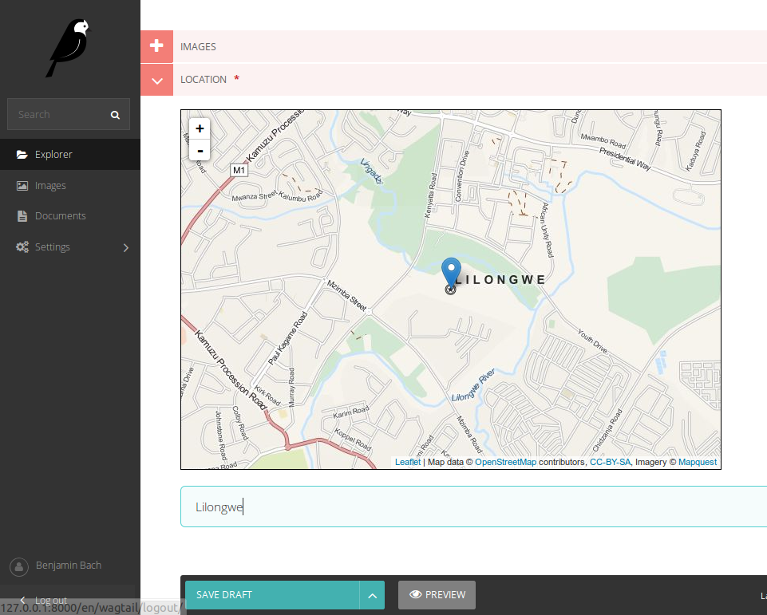

=============================
wagtailosm
=============================

.. image:: https://badge.fury.io/py/wagtailosm.png
    :target: http://badge.fury.io/py/wagtailosm

.. image:: https://travis-ci.org/benjaoming/wagtailosm.png?branch=master
    :target: https://travis-ci.org/benjaoming/wagtailosm

.. image:: https://pypip.in/d/wagtailosm/badge.png
    :target: https://pypi.python.org/pypi/wagtailosm

Open Street Map integration for Wagtail

Features
--------

Simple integration of OpenStreetMaps in wagtail using the ``osm_field`` implementation.

Use it as with ``osm_field``: If you want maps but don't need GIS.

Usage: `See docs <http://wagtailosm.readthedocs.org>`_.

How it looks
------------

Improvements?
-------------

This project took about 2 hours. Nothing is sacred, please contribute.

