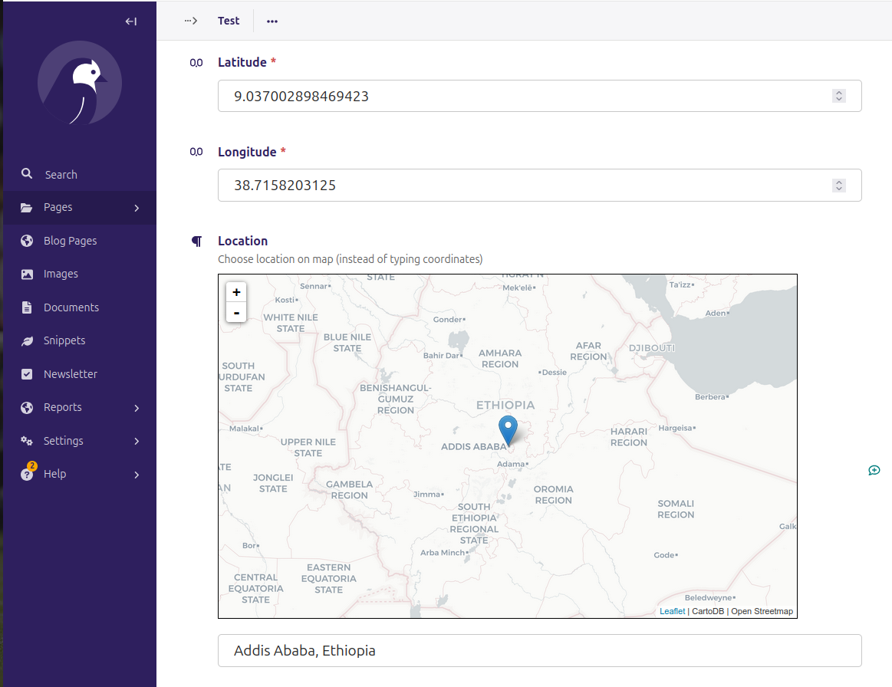

.. complexity documentation master file, created by
   sphinx-quickstart on Tue Jul  9 22:26:36 2013.
   You can adapt this file completely to your liking, but it should at least
   contain the root `toctree` directive.

Contents:
=========

This project was made very quickly and encourages you to contribute just as quickly and directly to its documentation and code. Or make it your own immediately!

.. toctree::
   :maxdepth: 2
   usage

Feedback
========

Opening PRs on the main repo is encouraged: http://github.com/benjaoming/wagtailosm main repository.
